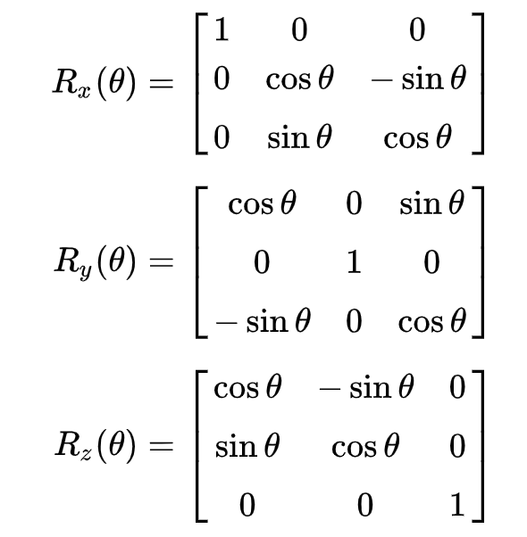

# ASCII Art program
An ASCII Art program that displays 3D shapes as their 2D projections made up of ASCII characters using graphics and linear algebra knowledge and allows the user to spin the shape using arrow controls, programmed in C++.

Basic 3D Rotations for X, Y, and Z planes.

